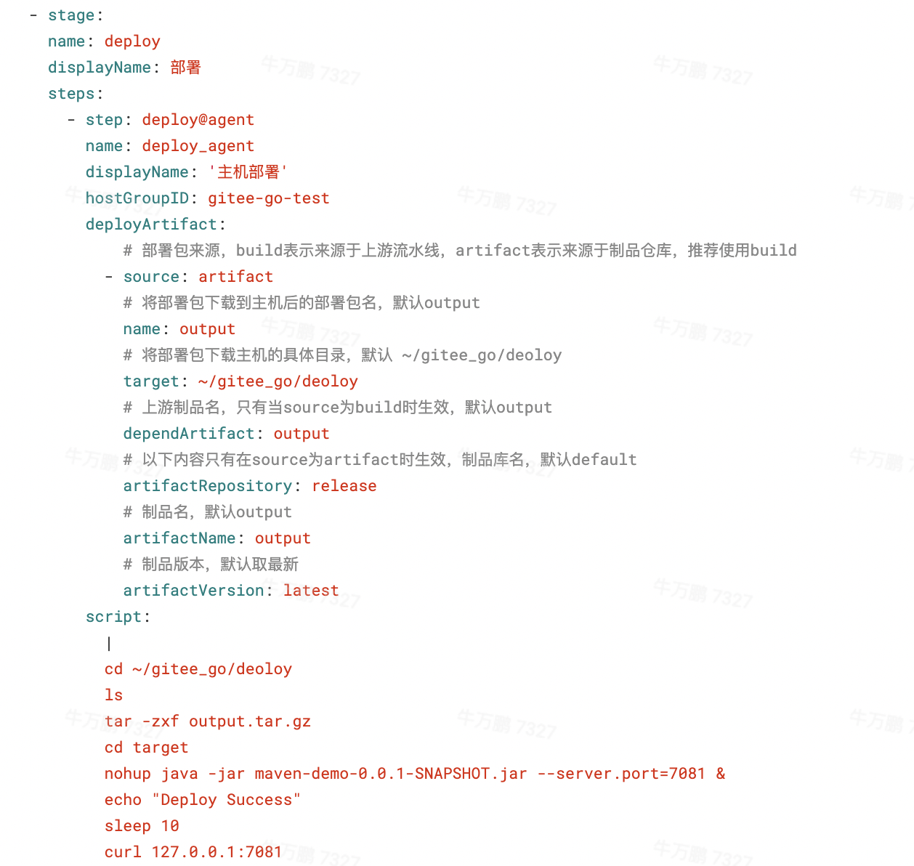

# Gitee Go Maven 使用示例

## 注意事项
在MasterPipeline.yml和BranchPipeline.yml两个文件中，内置了部署阶段，如下图所示。用于将构建产出部署到远程主机上，如您不需要部署远程主机可删除此任务。如需要部署远程主机，请按照如下手册添加主机，并在yml中更改 hostGroupID。[添加主机戳这里>>>](https://gitee.com/help/categories/76)

## 帮助手册
https://gitee.com/help/categories/69